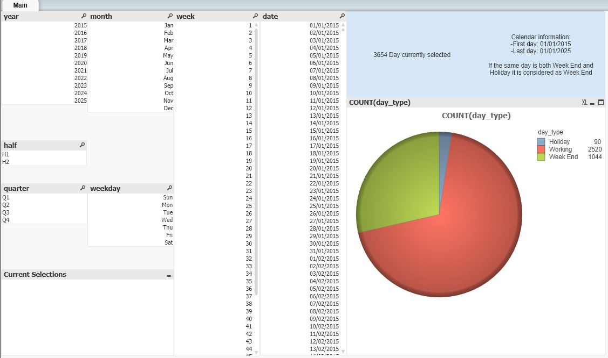

# QlikView Caledar

## Introduction

Many times you have to create calendar based reports so it would be nice to have a calendar already in place and ready to copy/paste into your reports script. In this case I am focusing on QlikView reports and since I am currently based in Italy I will consider the working days/non working days are based on Italian legislation.
To generate a **italy_holidays.csv** CSV file containing the holidays in the required timeframe I am going to use [Python](https://www.python.org/) and then I will use [QlikView](https://www.qlik.com/us/products/qlikview) to ETL the data and create the report.

The working days/non working days are based on Italian legislation (example for year 2020):

* New Year’s Day (Capodanno) – 01/01/2020
* Epiphany (Epifania) - 06/01/2020
* Easter Monday (Lunedì di Pasqua) – 13/04/2020
* Liberation Day (Liberazione dal nazifascismo) - 25/04/2020
* Labour Day (Festa del lavoro) - 01/05/2020
* Republic Day (Festa della Repubblica) - 02/06/2020
* Assumption of Mary (Assunzione di Maria) – 15/08/2020
* All Saint’s Day (Ognissanti) - 01/11/2020
* Saint Ambrose Patron of Milano (Sant'Ambrogio Patrono di Milano) - 07/12/2020 (only valid for Milano)
* Immaculate Conception (Immacolata Concezione) - 08/12/2020
* Christmas Day (Natale di Gesù) - 25/12/2020
* St. Stephen’s Day (Santo Stefano) - 26/12/2020

## Software and Libraries

This project uses Python 3.11 and the most important packages are:

* [argparse](https://docs.python.org/3/library/argparse.html)
* [holidays](https://pypi.org/project/holidays/)

For the report I have used [QlikView](https://www.qlik.com/us/products/qlikview) version 12.50.20200.0

## Local configuration

To setup a new local enviroment and install all dependencies you can run `.\my_scripts\Set-Up.ps1`. It will install:

* [Python](https://www.python.org/)
* [uv](https://docs.astral.sh/uv/)
* [Pre-commit](https://pre-commit.com/)

Pre-commit is a framework for managing and maintaining multi-language pre-commit hooks. A pre-commit hook is a script that runs before a commit operation in a version control system. This allows to shift left code quality checks and remediations. You can change the hooks by updateing the file `.pre-commit-config.yaml`.

To trigger the pre-commit hooks without an actual commit you can run `pre-commit run --all-files -v`.

## Data

Have a look at the `data` folder and its [DATA.md](data/DATA.md) file.

## Testing

No test implemented.

## Running the code

To generate the holiday CSV file you have to run `python generate_holidays.py --start_year 2015 --end_year 2025` where `--start_year` and `--end_year` are optional parameters.

To reload the qvw document you can run `run_report.cmd`.

## Results

The report is pretty simple and it is just a check that everything is working as expected:

Of course it is possible to play around with the filters and check how the count of day_type changes.

## List of activities

In the [TODO.md](TODO.md) file you can find the list of tasks and on going activities.

## Licensing and acknowledgements

Have a look at [LICENSE.md](LICENSE.md) and many thanks to the author this awesome [post](https://community.qlik.com/t5/QlikView-Documents/How-to-create-a-Calendar/ta-p/1491361) from [mov](https://community.qlik.com/t5/user/viewprofilepage/user-id/6636) on the [community.qlik.com](https://community.qlik.com) website.

## Outro

I hope this repository was interesting and thank you for taking the time to check it out. On my Medium you can find a more in depth [story](https://medium.com/@simone-rigoni01/quick-and-easy-calendar-with-python-and-qlikview-cdd5d2db30e1) and on my Blogspot you can find the same [post](https://simonerigoni01.blogspot.com/) in italian. Let me know if you have any question and if you like the content that I create feel free to [buy me a coffee](https://www.buymeacoffee.com/simonerigoni).